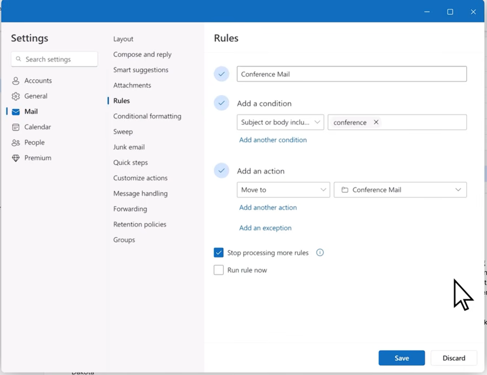
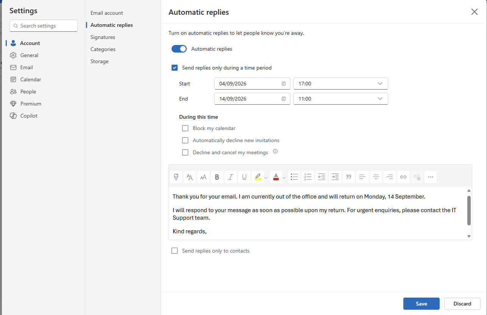

# Microsoft Outlook

A quick reference to key Microsoft Outlook tools and features.

**Note:** Microsoft Outlook is available in several versions, including Classic Outlook, New Outlook, and Outlook on the web. The location and appearance of some settings may vary depending on the version being used.

## Email Organisation

### Inbox Rules

Rules automatically manage incoming emails based on conditions such as the sender, subject, or recipient.

Common examples include:

- Move emails from a particular sender into a specific folder.
- Move newsletters and automated notifications out of the main inbox.
- Flag emails containing specific words in the subject.
- Organise emails relating to a particular customer or project.

The example above moves emails containing the word **"conference"** into a dedicated **Conference Mail** folder.

### Folders

Folders help organise emails into separate locations within a mailbox, making messages easier to manage and find.

Common examples include folders for specific customers, projects, invoices, newsletters, and automated notifications.

Folders can be combined with **Inbox Rules** to automatically organise incoming emails.

### Categories

Categories use labels and colours to help organise and identify emails, calendar events, and other Outlook items.

### Flags

Flags can be added to emails that require follow-up or further action.

### Archive

Archive moves emails out of the main inbox while keeping them available for future reference.

## Automatic Replies

Automatic Replies can send a predefined response when you are unavailable, such as when you are on annual leave.

A start and end time can be configured so that replies are automatically enabled and disabled.

Automatic Replies can also be configured differently for people inside and outside the organisation.

## Calendar

The Outlook calendar can be used to organise appointments and meetings, view availability, and collaborate with other users.

- **Scheduling Assistant** – Compare attendee availability to find a suitable meeting time.
- **Recurring Meetings** – Schedule meetings to repeat daily, weekly, monthly, or on a custom schedule.
- **Shared Calendars** – Share calendars with others and control whether they can view availability, see event details, or make changes.

## Shared Mailboxes

Shared mailboxes allow multiple authorised users to manage a common email address, such as `support@company.com`.

They are commonly used by teams such as IT Support, Finance, or Customer Service, allowing users to read and respond to messages from a central mailbox.

### Send As vs Send on Behalf

- **Send As** – The message appears to have been sent directly from the shared mailbox.
- **Send on Behalf** – The message shows that a user sent it on behalf of the shared mailbox.

## Signatures

Email signatures automatically add predefined information such as a name, job title, company, and contact details to outgoing messages.

Different signatures can be configured for new messages and replies.

## Search

Outlook's search and filtering tools can be used to find messages by **sender, recipient, subject, keywords, date, or attachments**.
